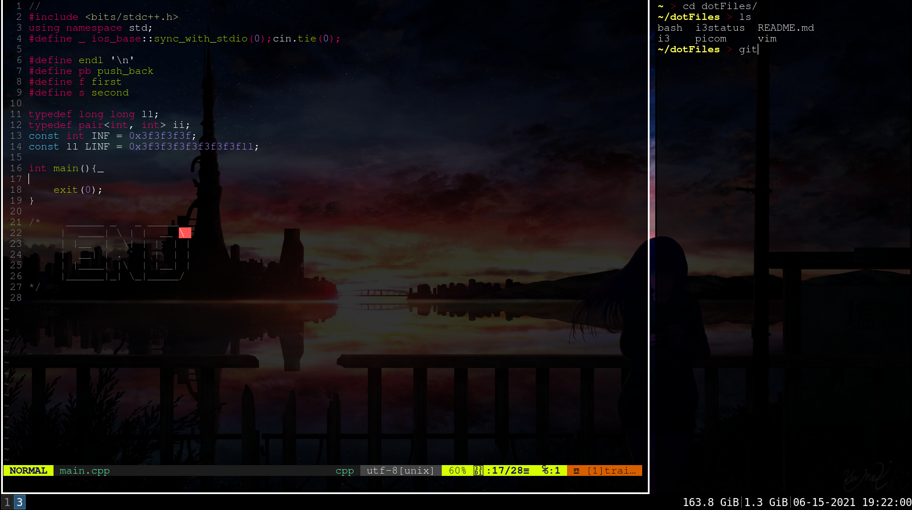
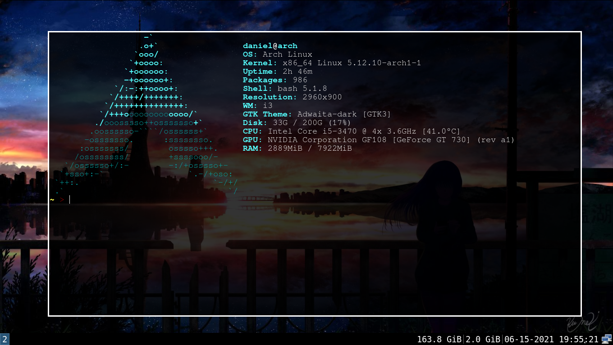
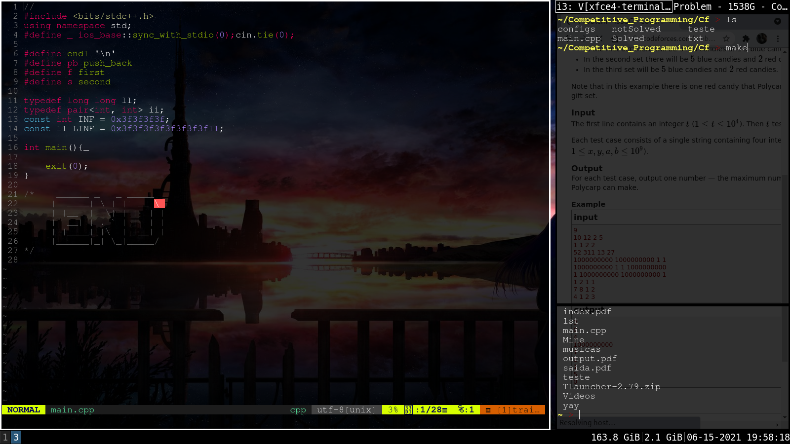

# dotFiles
Config and customization files.
[OUT DATED]

Desktop first screen, active windows have white borders, 10 inner gaps and -10 inner outer.

If you like floating windows

For Competitive Programming

# Installing

## YAY

Install [Yet Another Yogurt - YAY](https://github.com/Jguer/yay)

## i3Gaps

Install [I3-Gaps](https://archlinux.org/packages/community/x86_64/i3-gaps/)

## i3Status

Install [i3Status](https://archlinux.org/packages/community/x86_64/i3status/)

## Picom

Install [Picom](https://archlinux.org/packages/?name=picom)

## VIM
Install [VIM](https://archlinux.org/packages/?name=vim)

# Configs

## i3
    
1. MOD mod4 - (super/window key)

2. WASD moves, R for resize, SPACE float window, Q kill active window...(Check all shotcuts on config file);

3. On i3 start: 
    * exec setxkbmap -model abnt2 -layout br
    * exec xrandr --output DVI-I-1 --right-of VGA-1
    * exec picom &
    * exec nitrogen --restore
     Thats (1.) Set keyboard abnt2, (2.) I've 2 monitors, so config them. (3.) Start picom, and (4.) Nitrogen Wallpaper.
    
4. Border size 10 inner ans -10 outer, active windows have white borders.

## i3status

1. Disk Space
2. Memory Used
3. Date-time (MM/DD/AA HH:MM:SS);

## picom

Just for transparency, so remove everything and set vsync off.

## Vim

1. Vim Theme [Molokai](https://github.com/sickill/vim-monokai)
2. Tabstop=4 Shiftwidth=4

### Vim extensions
* [Syntastic](https://vimawesome.com/plugin/syntastic)
* [vim-airline](https://vimawesome.com/plugin/vim-airline-superman)
* [vim-cpp-enhanced-highlight](https://vimawesome.com/plugin/vim-cpp-enhanced-highlight)
* [youcompleteme](https://vimawesome.com/plugin/youcompleteme)

and this is all for while.
