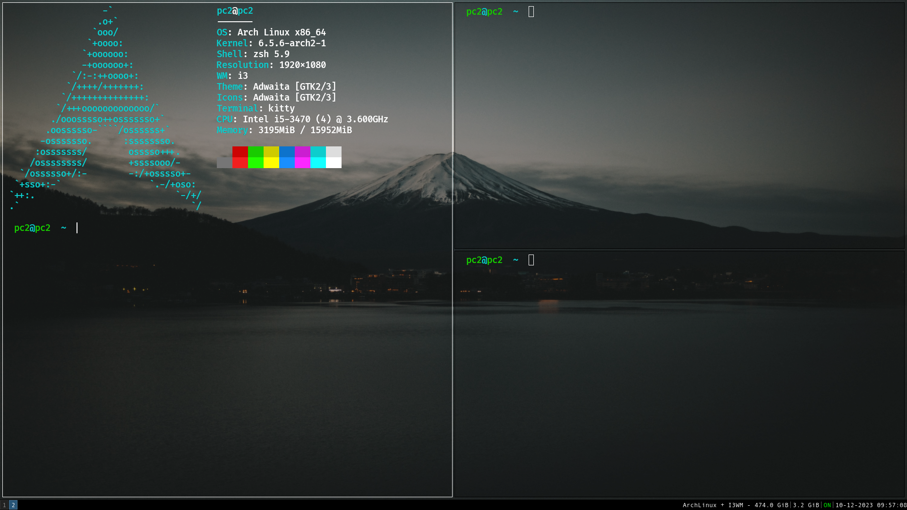

# dotFiles



# Table of Content

1. [Script to Config](https://github.com/DanielAugusto191/dotFiles/tree/new#script-to-config)
2. [Images](https://github.com/DanielAugusto191/dotFiles/tree/new#images)
3. [Installing Programs](https://github.com/DanielAugusto191/dotFiles/tree/new#installing-programs)
4. [Some Configs](https://github.com/DanielAugusto191/dotFiles/tree/new#some-configs)

# Script to Config
My new config and custom files.

Now i added a script file to config all easly. And just for fun, i made it in Hush with is a script language based in Rust. It will install my configs to:
- i3Gaps
- i3status
- neovim
- bash
- zsh
- picom
- kitty

To put all files in the right dirs, do:
``` shell
chmod +x install.hsh
./install.hsh 1 {folder_with_files}

# ex:
./install.hsh 1 20231210_122530
# this will get files in folder named: "20231210_122530"
```
Also i added an option to collect all my main files at once:
``` shell
chmod +x install.hsh
./install.hsh 2
```
This will create a direction on the scrip folder with all the files.

If you do not have permission to chmod, you will need to install [Hush](https://aur.archlinux.org/packages/hush) and run:
```shell
hush install.hsh 1 {folder_with_files}
```
and to get all your files in a dir:
```shell
hush install.hsh 2
```

NOTES:
In high cunstomized enviroments, maybe the "~" is not setted make shure to set it.

# IMAGES
Active windows have white borders, 5 inner gaps


If you like floating windows


Workspace  


For Competitive Programming
Inlay Hints, Error Lens


Images in terminal


# Installing Programs

## YAY
Package Manager
Install [Yet Another Yogurt - YAY](https://github.com/Jguer/yay)

## i3Gaps
Windows Manager
Install [I3-Gaps](https://archlinux.org/packages/community/x86_64/i3-gaps/)

## i3Status
Bar
Install [i3Status](https://archlinux.org/packages/community/x86_64/i3status/)

## i3lock
Block screen
Install [i3lock](https://github.com/i3/i3lock)

## Vim-Plug
Vim Plug
Install [VimPlug](https://github.com/junegunn/vim-plug)

## Picom
Transparency
Install [Picom](https://archlinux.org/packages/?name=picom)

## Neofetch
Print archlogo in terminal
Install [Neofetch](https://aur.archlinux.org/packages/neofetch-git)

## Nitrogen
Wallpaper
Install [Nitrogen](https://aur.archlinux.org/packages/nitrogen-git)

## Kitty
Terminal
Install [Kitty](https://archlinux.org/packages/?name=kitty)

Others:
Pulseaudio - For audio source.
icat - Print Images in terminal

# Some Configs

Change all this as yor prefer

## i3
    
1. MOD mod4 - (super/window key)

2. WASD moves, MOD+R for resize, MOD+SPACE float window, MOD+Q kill active window...(Check all shotcuts on config file);

3. On i3 start: 
    * exec setxkbmap -model abnt2 -layout br
    * exec xrandr --output DP-1 --mode 1920x1080 --rate 120.0
    * exec pulseaudio --start &
    * exec picom &
    * exec nitrogen --restore
    <br>Thats (1.) Set keyboard abnt2, (2.) Monitor config. (3.) Start Pulseaudio (4.) Start picom, and (5.) Nitrogen Wallpaper
    
4. Border size 5 inner, active windows have white borders.

## picom

Just for transparency, so remove everything and set vsync off.

<hr>

and this is all for while.
